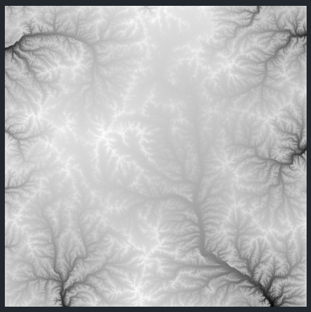

# vs-geotiff

vs-geotiff is a Visual Studio Code extension for viewing `TIFF` and `GeoTIFF` data natively. This extension is primarily intended for displaying floating point data.

This extension was written because existing extensions didn't support floating point `TIFF` data and were unmaintained.

## Features

- Image information in statusbar

- Renders `TIFF` and `GeoTIFF` files as an editor, with correct alpha clipping of `NaN` and `GDAL_NODATA` values.
- Supports `Float32`, `Float64` and Stripped / Tiled Layout TIFF Files
- Zoom and pan controls, with `CTRL+Scroll` and mouse dragging

- Supports various shading schemes for different applications

## Extension Settings

This extension contributes the following settings:

* `vs-geotiff.defaultShading`: Default shading scheme setting

## Known Issues

vs-geotiff currently doesn't render RGB TIFF data correctly. Pull requests are welcome. 

Some tiff files can take longer to load, due to the javascript native TIFF loading library.

## Release Notes

### 0.0.1

Initial Release